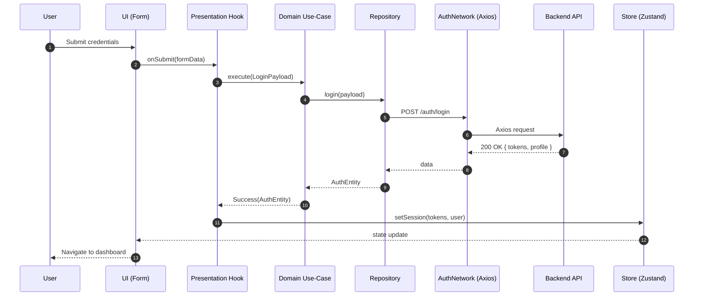

# Bank Notification Reader Frontend

A privacy-focused bank email notification reader UI built with React, TypeScript, and Vite. Integrates with a NestJS + Postgres backend for authentication, Gmail connection, and bank notification insights.

---

## Table of Contents

- [Features](#features)
- [Tech Stack](#tech-stack)
- [Architecture](#architecture)
- [Folder Structure](#folder-structure)
- [Setup & Development](#setup--development)
- [Environment Variables](#environment-variables)
- [API Integration](#api-integration)
- [Realtime sync (Socket.IO)](#realtime-sync-socketio)
- [Routing & Access Control](#routing--access-control)
- [Error Handling](#error-handling)
- [Styling](#styling)
- [Contributing](#contributing)
- [Architectural Design](#architectural-design)
- [Diagrams](#diagrams)

---

## Features

- **Authentication:** Register, login, Google login, refresh tokens
- **Password Reset:** Request link, verify token, set new password
- **Gmail Connection:** Initiate OAuth, show sync status, manual sync (UI planned)
- **Dashboard:** View bank notification summaries and details (planned/expanding)
- **Privacy:** No raw email content stored; transparency on data scanned and sync status

---

## Tech Stack

- React 18 + TypeScript
- Vite (dev/build tooling)
- React Router (routing)
- Zustand (state management)
- React Hook Form + Zod (forms + validation)
- Axios (HTTP)
- tsyringe (dependency injection)
- Tailwind CSS (styling)

---

## Architecture

- **Feature-first, Clean Architecture:**
  - Presentation: Components, pages, hooks, local state
  - Domain: Use-cases, repository interfaces, entities (UI-agnostic)
  - Data: Concrete data sources (network), models
- **Dependency Injection:** DI container (tsyringe) wires implementations at bootstrap
- **State Management:** Zustand slices per feature
- **Routing:** Public/protected routes with loaders and layout boundaries

---

## Folder Structure

```
src/
├─ App.tsx           # App root, router provider
├─ main.tsx          # Bootstrap, DI setup
├─ index.css         # Global styles
├─ core/
│  ├─ assets/        # Images, static assets
│  │  └─ images/
│  ├─ common/
│  │  ├─ domain/
│  │  │  └─ entity/
│  │  └─ presentation/
│  │     ├─ components/
│  │     │  ├─ forms/
│  │     │  ├─ layouts/
│  │     │  └─ ui/
│  │     └─ pages/
│  ├─ constants/     # Env, image constants
│  ├─ errors/        # Failure, ServerException
│  ├─ helpers/       # Error extraction helpers
│  ├─ init-dependencies/ # DI wiring
│  ├─ interfaces/    # Shared interfaces (e.g., pagination)
│  ├─ lib/           # Utility functions
│  ├─ network/       # Axios instances, network helpers
│  ├─ route/         # Router, auth loaders
│  └─ use-case/      # Base UseCase contracts
├─ features/
│  ├─ authentication/
│  │  ├─ data/
│  │  │  ├─ datasource/
│  │  │  ├─ model/
│  │  │  └─ repository/
│  │  ├─ domain/
│  │  │  ├─ entity/
│  │  │  ├─ repository/
│  │  │  └─ use-case/
│  │  ├─ presentation/
│  │  │  ├─ components/
│  │  │  ├─ pages/
│  │  │  └─ state/
│  │  └─ validation/
│  ├─ accounts/
│  ├─ bank/
│  ├─ category/
│  ├─ currency/
│  ├─ dashboard/
│  ├─ email/
│  ├─ insights/
│  ├─ notification/
│  ├─ settings/
│  ├─ transactions/
│  └─ user/
└─ types/
```

---

## Setup & Development

**Prerequisites:** Node.js LTS, npm

```sh
npm install           # Install dependencies
npm run dev           # Start dev server
npm run build         # Build for production
npm run preview       # Preview production build
npm run lint          # Lint code
npm run format        # Format code
npm run format:check  # Check formatting
```

---

## Environment Variables

- `VITE_BACKEND_URL` — Base URL of the backend API (e.g., http://localhost:3000)
- Set in `.env` and consumed via `import.meta.env` in `src/core/constants/env.constants.ts`

---

## API Integration

Below are the backend endpoints used by the frontend according to the feature datasource/network files.

Authentication

- POST /auth/login — Obtain tokens (login)
- POST /auth/register — Create user (register)
- POST /auth/refresh-token — Rotate access token
- POST /auth/google — Google login
- GET /auth/request-reset-password?email={email} — Send reset link
- POST /auth/verify-token — Verify reset token
- POST /auth/reset-password — Set new password
- GET /auth/me — Get user profile
- PUT /auth — Update user (name, preferredCurrency)
- PUT /auth — Update password (newPassword, oldPassword)

Email / Gmail sync

- GET /email/get-auth — Get OAuth URL to start Gmail linking
- POST /email/get-token — Exchange OAuth code for access (request body)
- GET /email/sync-status — Get current sync status
- POST /email/manual-sync — Trigger a manual sync (body: {})
- GET /email/verify-label-access?label-name={labelName} — Verify access to a Gmail label
- POST /email/revoke-access — Revoke Gmail access and delete synced data

Transactions

- GET /transaction?{query} — Get transactions (query params: page, limit, transactionType, startDate, endDate,
  categoryIds (repeatable), accountIds (repeatable), bankIds (repeatable), search, order, sort)
- GET /transaction/{id} — Get transaction by ID
- PUT /transaction/{id} — Update transaction (categoryId, commonName, applyToAll)
- GET /transaction/summary?startDate={startDate}&endDate={endDate} — Get transaction summary

Accounts

- GET /account — Get accounts list
- GET /account/{id} — Get account by ID
- GET /account/summary — Get account summary

Bank

- GET /bank — Get banks list
- GET /bank/{id} — Get bank by ID

Category

- GET /category — Get categories list
- GET /category/{id} — Get category by ID

Notification

- GET /notification?page={page}&limit={limit}[&isRead={true|false}] — Get notifications (pagination, optional isRead
  filter)
- GET /notification/{id} — Get notification by ID
- PUT /notification/{id} — Mark notification as read
- POST /notification/mark-all-as-read — Mark all notifications as read
- DELETE /notification/{id} — Delete a notification
- DELETE /notification/ — Delete all notifications

Currency

- GET /currency — Get currencies list

Other notes

- Most feature network clients use a shared Axios wrapper (`src/core/network/custom-axios.ts`) which applies auth
  headers and the base URL where applicable; some network files build paths using `BASE_URL` from
  `src/core/constants/env.constants.ts` while others use relative paths and the shared Axios client.

---

## Realtime sync (Socket.IO)

This project also connects to a Socket.IO realtime gateway used for sync operations and notifications. The frontend
listener is implemented in `src/core/common/presentation/state/hooks/use-sync.ts` and behaves as follows:

- Connection
    - Endpoint: `${BASE_URL}/sync` (falls back to `http://localhost:3000/sync` if `BASE_URL` is not set)
    - Client: `socket.io-client`
    - Auth: sends the user's access token as `auth: { token }` when establishing the socket connection
    - Transport: `websocket` (configured via `transports: ['websocket']`)

- Events listened
    - `connect` — logs a successful connection
    - `connect_error` — logs connection errors
    - `notifications` — server explicitly notifies the client about new notifications; handler invalidates the
      `['notifications']` query
    - `sync_started` — emitted when a sync begins; handler invalidates `['notifications']` and `['sync-status']`
    - `sync_completed` — emitted when a sync finishes; handler invalidates the following queries to refresh data in the
      UI:
        - `['notifications']`
        - `['sync-status']`
        - `['recent-transactions']`
        - `['transactions-by-type']`
        - `['transactions-by-bank']`
        - `['dashboard-transaction-summary']`

- Cleanup
    - The hook disconnects the socket when the component using the hook unmounts or the token changes.

Notes

- The hook uses React Query's `queryClient.invalidateQueries()` with the keys listed above — make sure these keys match
  the query keys used across the app to ensure data is refreshed correctly when events arrive.
- If you run the frontend against a different backend host, ensure `VITE_BACKEND_URL` (or `BASE_URL` in
  `src/core/constants/env.constants.ts`) points to the server that exposes the `/sync` socket namespace.

---

## Routing & Access Control

- **Public routes:** `/login`, `/register`, `/forget-password`, `/reset-password`
  - Redirect to dashboard if authenticated
- **Protected routes:**
  - `/` (dashboard)
  - `/link-email` (link email for Gmail sync)
  - `/transactions` (view transactions)
  - `/accounts` (manage accounts)
  - `/insights` (view insights)
  - `/settings` (user settings)
  - Require valid session; else redirect to `/login`

---

## Error Handling

- Typed errors (Failure, ServerException) at each layer
- Mapping helpers for user-friendly messages
- Presentation hooks surface errors via toast/messages

---

## Styling

- Tailwind CSS utility classes
- UI primitives: button, input, label, card
- Layout components for consistent structure

---

## Contributing

- Feature-first structure, clean architecture boundaries
- DI via tsyringe, explicit use-cases
- Repository interfaces are UI-agnostic
- Small, focused components; co-locate tests

---

## Architectural Design

This project follows a **feature-first, clean architecture** approach, ensuring separation of concerns, testability, and scalability. The main architectural concepts are:

### 1. Layered Structure

- **Presentation Layer:**
  - Contains UI components, pages, hooks, and local state.
  - Handles user interaction, form validation, and state display.
  - Example: `src/features/authentication/presentation/` and `src/core/common/presentation/`.
- **Domain Layer:**
  - Contains business logic, use-cases, repository interfaces, and entities.
  - Is UI-agnostic and does not depend on data or presentation layers.
  - Example: `src/features/authentication/domain/`.
- **Data Layer:**
  - Implements data access (API calls, models, data sources).
  - Maps network/data models to domain entities.
  - Example: `src/features/authentication/data/`.

### 2. Dependency Injection

- Uses `tsyringe` for dependency injection.
- All dependencies (repositories, use-cases) are registered at startup in `src/core/init-dependencies/`.
- Promotes loose coupling and easier testing.

### 3. State Management

- Uses Zustand for global state, with slices per feature.
- Local state is managed in components/hooks where appropriate.

### 4. Routing & Access Control

- Uses React Router for navigation.
- Public and protected routes are defined in `src/core/route/`.
- Loaders and layout boundaries enforce authentication and redirect logic.

### 5. Error Handling

- Typed errors propagate from data to presentation layer.
- Helpers map errors to user-friendly messages.

### 6. Extensibility

- New features are added as new folders under `features/`, each with its own data, domain, and presentation subfolders.
- Shared code lives in `core/common` and `core/helpers`.

---

## Diagrams

### Auth Flow (Mermaid)

The authentication flow in this project follows a clean separation of concerns and leverages the layered architecture. Here is how the flow works:

1. **User Interaction:**
   - The user submits their credentials (email/password or Google login) via a form in the UI.
2. **Presentation Layer:**
   - The form component calls a presentation hook (e.g., `useLogin`) which handles form state, validation, and submission.
3. **Domain Layer:**
   - The hook invokes a domain use-case (e.g., `LoginUseCase`) that encapsulates the business logic for authentication.
4. **Repository Abstraction:**
   - The use-case calls a repository interface, which abstracts the data source (network, local storage, etc.).
5. **Data Layer:**
   - The repository implementation makes an HTTP request to the backend API using Axios.
6. **Backend API:**
   - The backend validates the credentials and returns tokens and user profile data.
7. **Data Mapping:**
   - The repository maps the API response to a domain entity and returns it to the use-case.
8. **State Update:**
   - On success, the presentation hook updates the global state (Zustand store) with the new session and user data.
9. **Navigation:**
   - The UI navigates the user to the dashboard or shows error messages as appropriate.



---

## Notes

- Type safety: Zod schemas validate forms; DTO mapping isolates API contracts from UI
- Future: Gmail connection UI, bank notification list/detail UI, privacy dashboard, notifications
- See backend README for server/data privacy details
